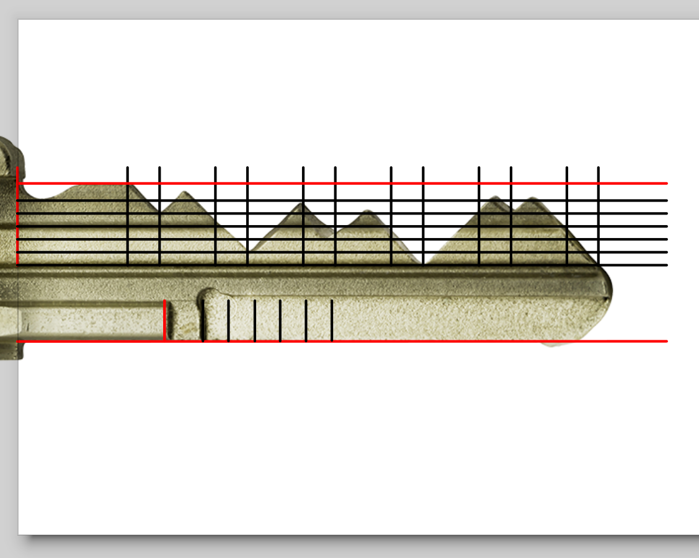
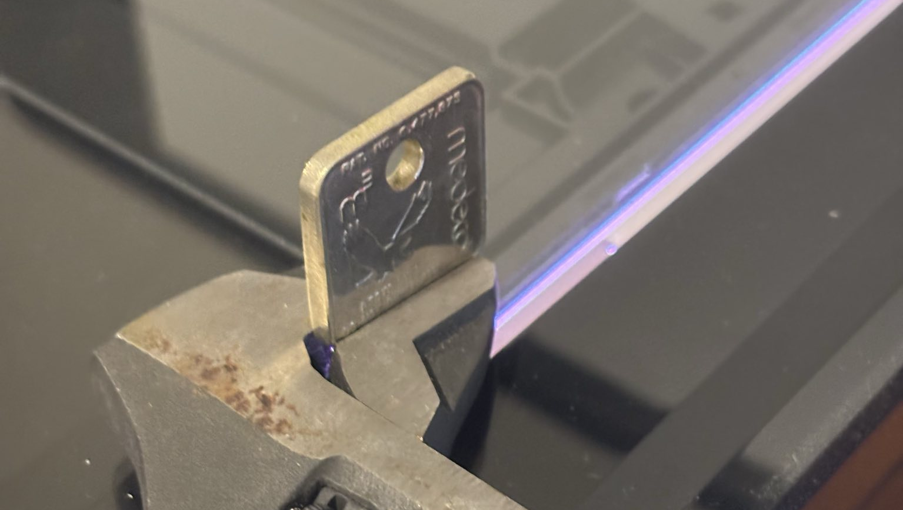
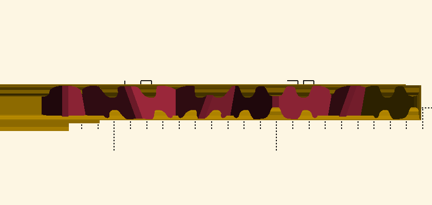

// How the fuck do I introcude this

Key control is important to many building owners who distribute keys to employees or tennants. Key control basically means an ordinary person cant go and clone their key at a locksmith. Either the locksmith won't be able to purchase blank keys, or they'll have a contract with a manufacturer to only purchase blank keys to cut for authorized persons. Often manufacturers will hold a patent on some design relating to the key making it difficult for legitimate key blank manufacturers such as [Ilco](https://www.ilco.us/products/residential-and-commercial-key-blanks) to make

One of Medeco's major selling points is key control. That kind of sucks when your landlord charges a large deposit for a spare key, or outright refuses to give you more keys. So how can we get around this?

This article assumes you have the basic knowledge of how locks work. // TODO: Find good explainer of pin-tumbler locks

## Glossary

- **bow** -- *the top of the key. the part that you hold and turn*
- **shoulder** -- *the alignment mechanism for a key. when you insert a key fully into a lock, this is the part that stops it from going in further*
- **blade** -- *the part of the key that's inserted into the lock*
- **bitting** -- *the measurements of the cuts into the key's blade*
- **sidebar** -- *an element on the side of the key blade, often to add complexity to lockpicking or key cloning*
- **warding** -- *the shape of the key hole. prevents you from putting the type of keys into a lock*
- **key control** -- *an attempt by a manufacturer to make it so that only "authorized individuals" can copy a key*
- **meow** -- *the sound a cat makes* 

## Depths

In this case I don't have a physical copy of the key I'm cloning

Most lock/keys, including Medeco, have standard depths and positions of key cuts. We can use this to our advantage, as we can guestimate that certain rough measurements will fall into these standard depths.

When you have a physical key in hand, it makes sense to use a [physical decoder card](https://www.redteamtools.com/devious-decoder-card). In my case, I don't have the key in my posession. One can roughly approximate a physical decoder with a photo decoder. A photo decoder is a transparent image with the depths, and top and bottom of a key. One can overlay that image onto a key, and align it to find the depths.

Since I didn't have a physical copy of the key I wanted to copy, I needed a photo decoder. And since I haven't found any photo decoders online, so I made my own.

// TODO: Download link.

## Angles

Notabily, Medeco Biaxial have 2 possible horizontal positions where a cut can be placed, The vertical lines across the keyway help one determine the "fore" or "aft" positions. For this reason, keys in my decoder need to be aligned at the shoulder.

Medeco keys also have rotational cuts with 3 possible angles. Assuming You're holding the key with the bow on top and tip on bottom, you can decode them like so: ascending left to right, no angle, and descending left to right

| Angle                        | Fore | Aft |
| ---------------------------- | ---- | --- |
| Ascending Left to Right (L)  | K    | M   |
| No Angle (C)                 | B    | D   |
| Descending Left to Right (R) | Q    | S   |

If you want some practice, the angles of the key in the above photo are visible on this page <https://ik.imagekit.io/twr9df4sfpl/dam/dam/AADSS1014173> [(Archive)](https://archive.ph/haCHk)

The bitting of the key in the above photo is `2D 5M 4S 6D 2S`. This key isn't the best example as it only uses Aft cuts, but it's one of the best photos I could find online.

## Sidebar

Medeco M3 keys also have a sidebar, This is also pretty straight forward to decode with my visual decoder. 6 is the cut closest to the shoulder (top of the key). There is a second level of depth which is used for complex master systems. I have always seen these cut to the same position which I have called the 0 cut

## Warding

Warding is machining that ensures only keys of a certian kind can fit in a certain key hole. All pin-tumbler keys I've seen have this.

I happen to have a sacrificial key with the same warding. I sanded it down flat so that I could get a scan of it on a high resolution flatbed scanner.

I then traced the keyway in inkscape, with some tolerance.

## Putting it together

[Someone has already made a lovely OpenSCAD generator for Medeco keys.](https://github.com/ervanalb/keygen/tree/master)

Adding my keyway was simple, I used [SVG2SCAD](https://github.com/Spiritdude/SVG2SCAD) and pasted the output into "medeco.gen.scad"

I also hastily added support for the M3 sidebar

## Result
