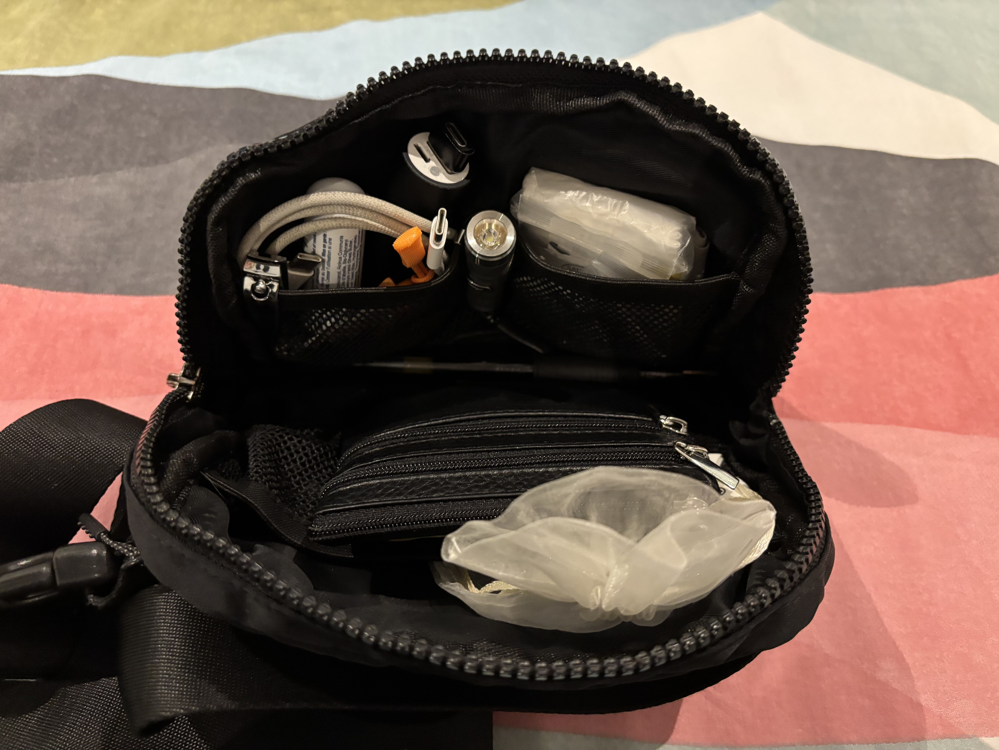
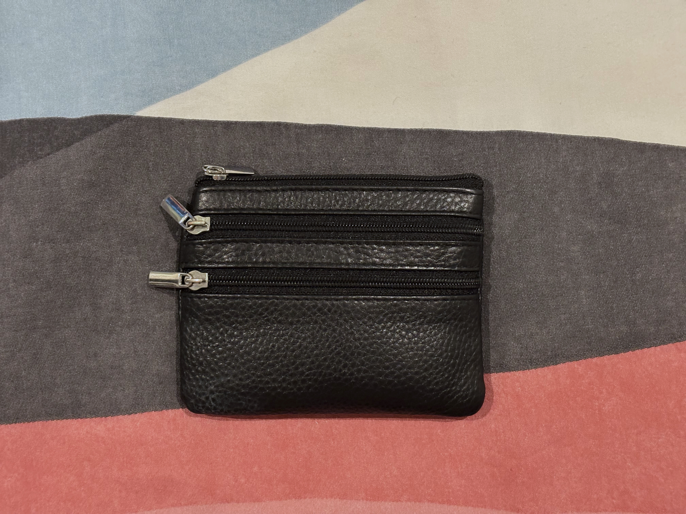
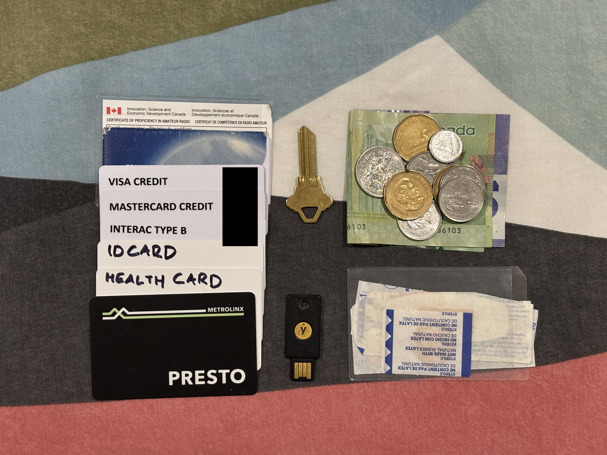
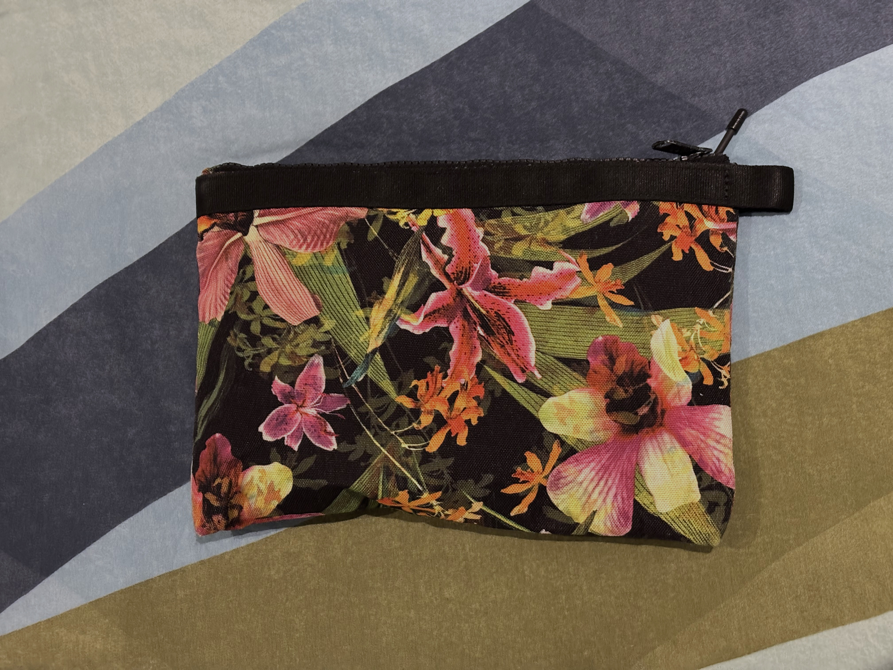
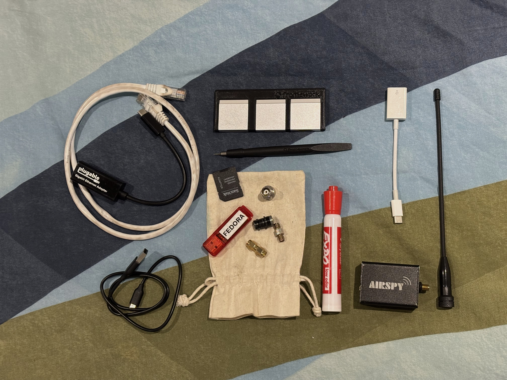

import { Picture } from 'astro:assets';
import EmailLink from "@/components/EmailLink.astro";

I became a bit obsessed with optimizing what I carry with me. Here's what I carry with me a lot of the time

## Purse

I have one of those Lululemon Everywhere belt bags that everyone seems to have. It has two zippered compartments: one on top and one on the back. The main compartment has three interior mesh organizing pockets: two small ones on the front side of the bag and one large one on the back side. 

My purse is made to be able to be carried standalone. When doing so I'll often toss in my earbuds and usb-c earbud adapter, as well clip my water bottle onto the strap with a carabiner.

I usually like to keep a USB-A plug to USB-A recepticle adapter in my purse, but I lost the one I had. I also used to have an Anker PowerCore 10000 which was recalled recently, and haven't been able to afford a replacement.

In the main compartment I have:
- Screwdriver: One of those promotional screwdrivers they used to hand out at trade shows
- Pilot G-2: Cheap to replace if ever I lose it
- [My wallet](#wallet)

In one of the smaller mesh organizers in the main compartment I have
- USB-C to USB-C cable
- Fiskars folding scissors: I use these almost every day.
- Nail clippers
- Lip Seal: Eucerin Aquaphor

Between the two small mesh organizers I've clipped
- Rovyvon A1 flashlight: USB-C rechargable little flashlight

And in the other small mesh organizer pocket I have
- Microfiber cloth
- Tissues
- Emergency meds
- Alcohol swabs
- Salt and pepper

In the large mesh organizer I have a small mesh bag with
- USB-C plug to USB-A recepticle adapter
- USB-B plug to USB-C recepticle adapter
- USB-B mini plug to USB-C recepticle adapter
- USB-B micro plug to USB-C recepticle adapter
- SanDisk Ultra Dual Drive 128 GB: Flashdrive with [Ventoy](https://www.ventoy.net/en/index.html). Has both USB-A and USB-C ends

And, in the back zippered compartment I keep
- USB-C to Lightning cable
- AirTag
- Blue key fob
- Black key fob

## Wallet

I have a small wallet with 3 zipper compartments, and one open pocket. There are 2 zipper compartments on one side of the wallet. The top of the wallet has a larger zip compartment capable of holding cards, and the side opposite of the 2 zipper slots has an open pocket.

It looks a bit like [this one I found on AliExpress](https://www.aliexpress.com/item/1005007336693975.html), but this one looks to be missing the open pocket.

(Photo of outside of wallet)

In the smallest zipper pocket:
- House key
- YubiKey 5 NFC

The 2nd front zipper pocket has:
- Coins

The main zipper pocket has cards I use less often, since cards are hard to add and remove from it:
- PRESTO card (transit card for Toronto area)
- Credit card
- 2nd credit card
- Provincial health insurance card
- NEXUS card

The open pocket has:
- Cash bills
- Radio license
- Bandages
- Debit card
- Provincial ID card

## Pouch

This pouch came free with my old backpack, and it seems to be discontinued. It's some sort of Herschel supply pouch in a limited edition Hoffman fabric.

I keep smaller stuff in here that isn't essential to my day-to-day life. I will leave this bag behind on days where I know I won't need it.

- 3 ft ethernet cable
- Plugable USBC-E1000 (USB-C to gigabit ethernet adapter)
- Expo dry erase marker
- Airspy R2 (Software defined radio reciever)
- SMA-F UHF antenna
- USB-A to USB-B micro cable
- USB-C plug to USB-A recepticle dongle

In a [3D printed framework expansion card holder](https://www.thingiverse.com/thing:6539791)
- Framework USB-A port
- Framework SD card slot
- Framework HDMI port

In a small mylar bag I have
- 16GB Micro Center flash drive
- SD to Micro-SD adapter
- SMA-F to SMA-F adapter
- SMA-M to SMA-M adapter
- SMA-M to BNC-M adapter
- SMA-F to BNC-M adapter

## Backpack

I chose a [Doughnut Macaroon](https://www.jetpens.com/Doughnut-Macaroon-Large-Backpack-Reborn-Lake/pd/42466) large backpack in their Lake color. I chose the darker color as I figured it would show dirt less, and I was correct in my assumption. It has way more organization options in comparison to my previous backpack, however I wish it had loops of webbing on the backpack straps to clip radios to.

After around year of owning it the recycled leather parts are disintegrating. The loop that keeps the tote handles closed broke at the stitches, and one of the front pouch straps also broke at the stitches. I would not recommend getting ones with recycled leather. 

  

    <Picture src={import("./_IMG_4962.jpg")} alt="Photo of the tote loop broken at the stitches."/>
  

  

    <Picture src={import("./_IMG_4964.jpg")} alt="Photo of one of the two front pouch straps broken at the stitches."/>
  

If anyone has good, cheap and not fugly backpack recomendations send me an <EmailLink>email</EmailLink> or an instant message!

Main compartment:
- Purse
- Pouch
- UNIQLO umbrella
- Water bottle

Laptop sleeve:
- KOKUYO Campus notebook: 6mm dotted rule for those who care
- Framework 13 laptop

Zipper pocket above the laptop sleeve:
- Emergency snacks (granola bars)
- N95 masks
- Spare earbuds
- USB-C to 3.5mm headphone jack adapter

Zipper mesh pocket:
- Anker 67W USB-C and USB-A power adapter

Open phone size pocket:
- LAMY safari fountain pen: Currently filled with J Herbin Bleu Pervenche 
- USB-C to 3.5mm headphone jack adapter
- 7HZ Salnotes Zero earbuds

Large velcro pocket:
- USB-C to USB-C cable
- USB-C to USB-A cable

In the buttoned front pouch:
- Nivea roll-on deoderant: Has a glass bottle so it wont get squeezed out everywhere
- Folding hair brush
- Daily meds container
- Altoids container with
  - Prescription meds
  - Ibuprofin
  - Acetaminophen
  - Pepcid (heartburn meds)
  - Lactase ensyme
  - Benadryl
  - Cetirizine hydrochloride 10 mg (allergy meds)

I'd love to see sorts of things my friends and other fellow nerds bring with them. <EmailLink>Show me what you pack with you!</EmailLink>